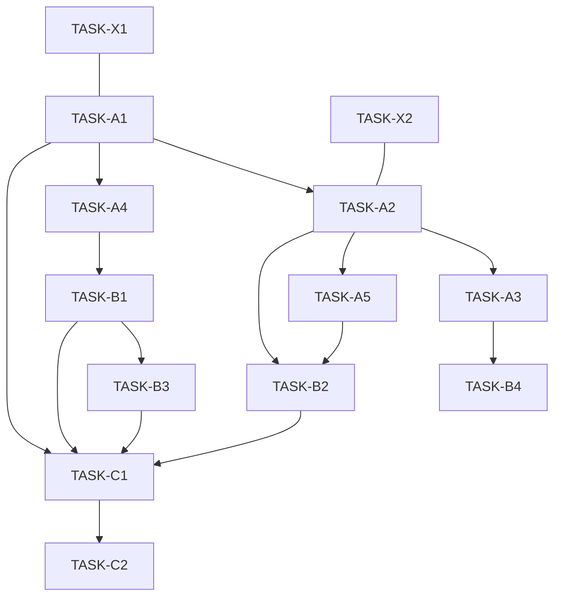

# 策略 MCP 整合 · 任务索引（V4.2）

> 生成日期：2025-11-11

- **阶段 A（P0）**：架构精简、执行抽象、契约与等价性闸门
  - TASK-A1｜服务精简落地（合并风控）
  - TASK-A2｜执行层抽象：IExecutor + Backtest/Live
  - TASK-A3｜BaseAdapter 契约固化（错误码/重试/节流/数量规范化）
  - TASK-A4｜CoreAlgorithm 输出契约与“单点判定”
  - TASK-A5｜等价性测试框架（回测 vs 执行器）

- **阶段 B（并行）**：边界/回测/实时/状态机
  - TASK-B1｜信号边界固化（Strategy 仅读 signals）
  - TASK-B2｜回测模式（独立运行）
  - TASK-B3｜实时模式 + 幂等执行
  - TASK-B4｜订单状态机（最小闭环）

- **阶段 C**：编排与文档
  - TASK-C1｜Orchestrator 集成与健康探针
  - TASK-C2｜文档与契约同步（V4.2）

- **横切（并行）**
  - TASK-X1｜单一事实来源“落地卫士”
  - TASK-X2｜向后兼容性与可复现

## 依赖关系（Mermaid）


## 建议执行节奏
- A 阶段 ~ 1 周；B 阶段 1–2 周；C 阶段 ~ 1 周（可根据团队规模并行）。
- 每个任务卡包含 DoD（验收标准），PR 必须引用对应任务 ID。

## 快速开始（本地最小验证）
1. 执行层切换验证：
```bash
python -m mcp.strategy_server --mode backtest --config configs/strategy.yaml
```

2. 等价性测试闸门：
```bash
pytest -k equivalence -q
```

3. 运行健康探针演示：
```bash
python -m tools.healthcheck --spec configs/strategy_spec.yaml
```

